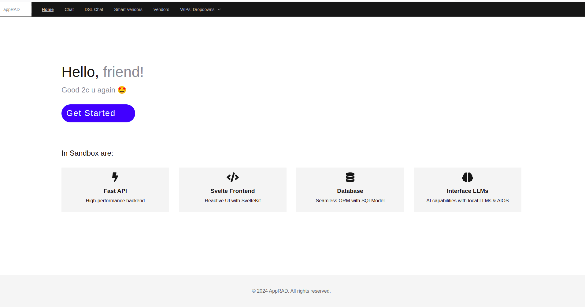
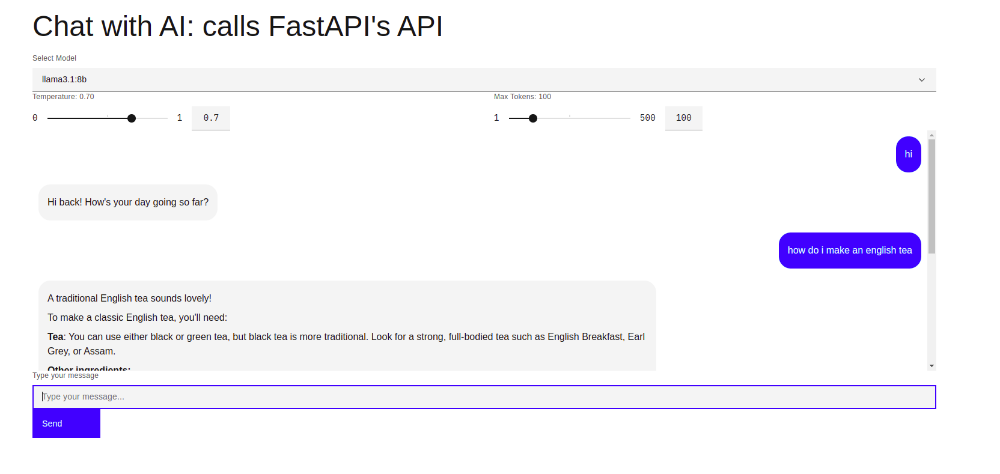
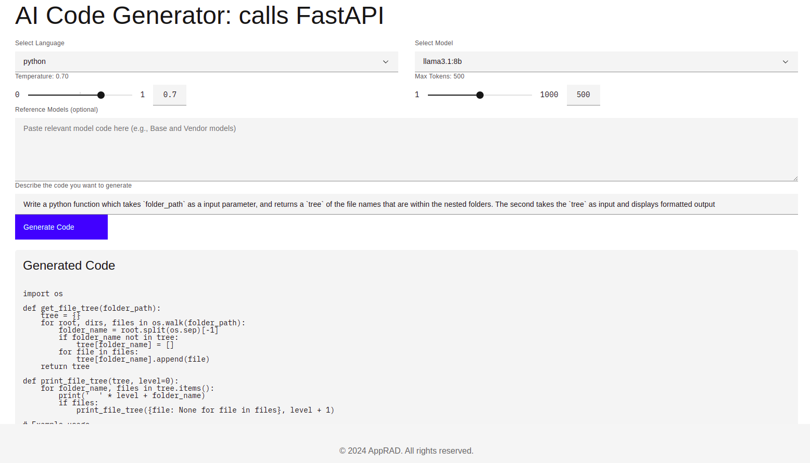
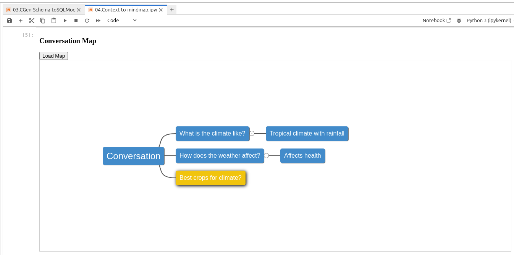
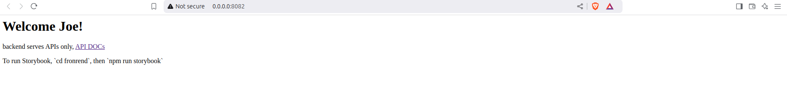
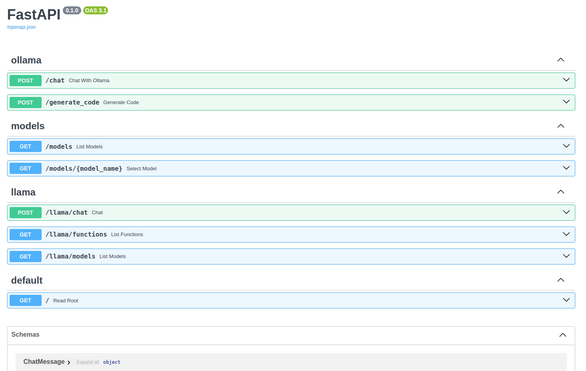
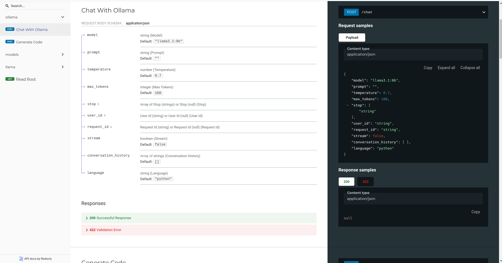
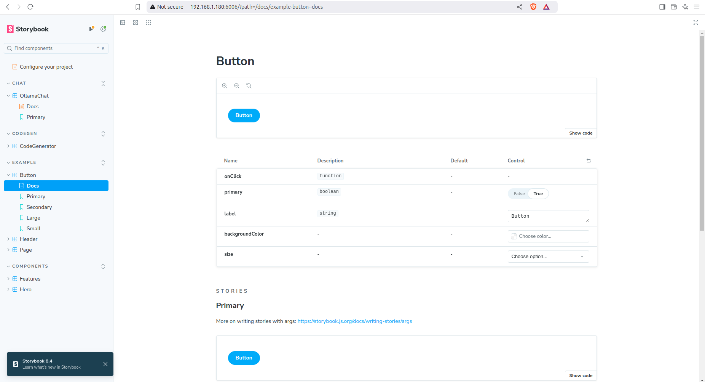
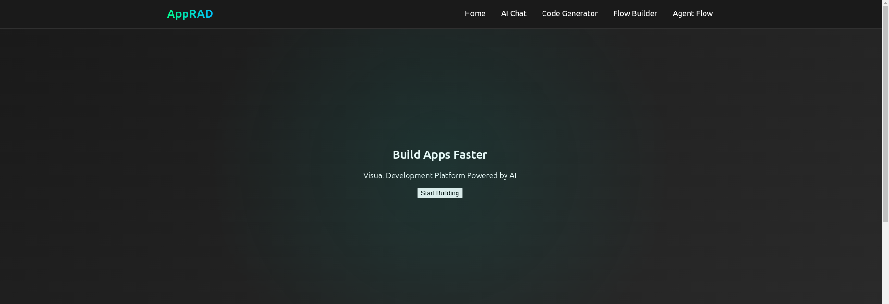

# Sandbox 
_Just got GIT! Exploring the new paradigms after 15+ year no coding_

## Landing Page



**The Hello World!, the Svelte way**  
```html
    <Column class="hero-content">
        <h1>
            Hello, <span class="highlight">{data.visited ? 'friend' : 'stranger'}!</span>
        </h1>

        <!--Use ternary operator in HTML-->
        <h2 class="highlight">
            {data.visited
               ? 'Good 2c u again 🤩'
               : 'Welcome! Glad 2c u 😎'
            }
        </h2>

        <Button href="/get-started" kind="primary" class="custom-button">Get Started</Button>
    </Column>
```                

## Chat


**Less Clutter**
```html
        <Row>
            <Column>
                {#if errorMessage}
                    <InlineNotification
                        kind="error"
                        title="Error"
                        subtitle={errorMessage}
                        hideCloseButton
                    />
                {/if}
                <div class="chat-container">
                    <div class="chat-history">
                        {#each chatHistory as message}
                            <div class={`chat-bubble ${message.role === 'user' ? 'user-bubble' : 'ai-bubble'}`}>
                                {#if message.role === 'user'}
                                    <p>{message.content}</p>
                                {:else}
                                    {@html formatMessage(message.content)}
                                {/if}
                            </div>
                        {/each}
                    </div>

                    {#if isLoading}
                        <ProgressBar />
                    {/if}
                </div>
            </Column>
        </Row>
```

## Code Generator: I got Huang Nguyen & Entu Chu! 



**Inital Structure**
- 2024.10.26: @WIP stucture: skeleton, concept only, untested.   

```yaml
├── 📑 README.md
├── 📑 main.py
├── 🗂️  backend
│   ├── 🗂️  controllers
│   │   └── 🗂️  bases
│   ├── 🗂️  db
│   │   └── 🗂️  stores
    │   │   ├── 📑 in-process.db
    │   │   ├── 📑 in-process.json
    │   │   ├── 📑 in-process.duck
    │   │   ├── 🗃️ contexts
│   │   └── 🗂️  tools
│   ├── 🗂️  helpers
│   ├── 🗂️  middlewares
│   ├── 🗂️  models
│   │   └── 🗂️  bases
│   │   └── 🗃️  enums
│   └── 🧰  utils
└── 🗂️  frontend (TBD)
    ├── 🗂️  src
    │   ├── 🗂️  lib
    │   ├── 🗂️  routes
    │   │   ├── 🗂️  chat
    │   │   ├── 🗂️  codegen
    │   │   ├── 🗂️  get-started
    │   └── 🗂️  utils
    └── 🗂️  static
```    




---

### To run this APP
2024.11.16: Revisiting after 2 weeks, I realized that I do forget ;)  
So here a small document!

#### 1. Serve the backend
   ```bash
   source ./sbox1/bin/activate
   fastapi run main.py --host 0.0.0.0 --port 8082
   ```

   If no error then following links will become available:
  
   - http://0.0.0.0:8082    
   Backend can also be used to serve frontend matters, but now they (HTMX+Jinja) assets are removed! Opting for Svelte 5 instead.
   

   - http://0.0.0.0:8082/docs    
   FastAPI for its simplicity and ease of use, and the auto generated docs are also nice.  
   

   - http://0.0.0.0:8082/redoc    
   

   - http://0.0.0.0:8082/openapi.json   


#### 2. Serve the frontend  (Storybook)
   ```bash
   source ./sbox1/bin/activate
   cd frontend
   npm run storybook 
   ```



#### 3. Serve the frontend
   ```bash
   source ./sbox1/bin/activate
   cd frontend
   npm run dev -- --open 
   ```



---

## __init__ vs namespace
...


## Concept of in-process, in-memory (DB & JSON), in-disk (ext files/contents)
...