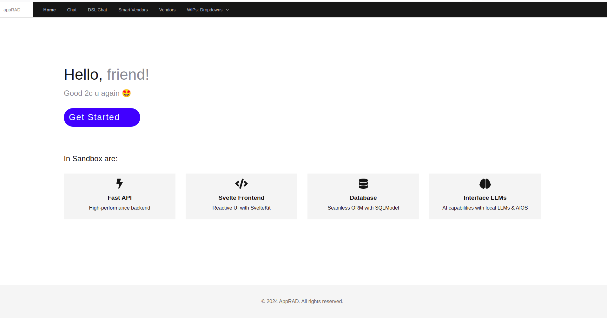
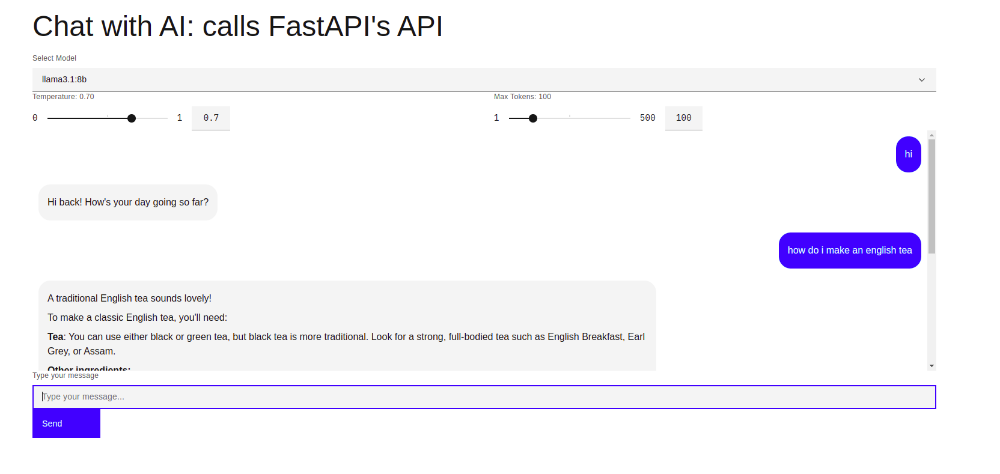
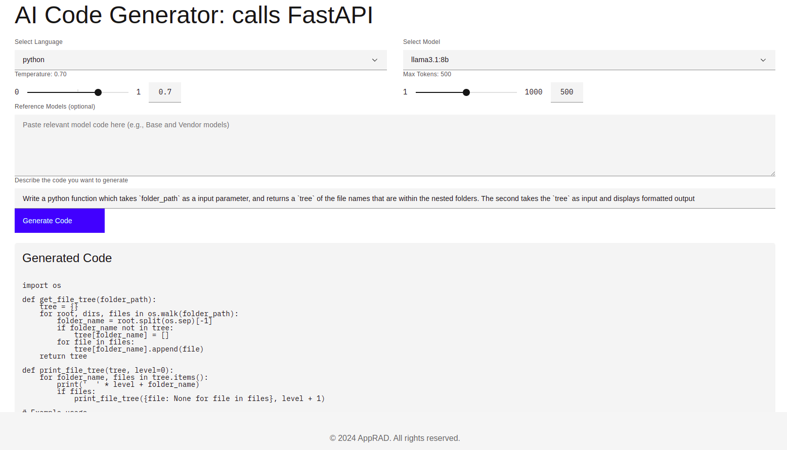

# Sandbox 
_Just got GIT! Exploring the new paradigms after 15+ year no coding_

## Landing Page



**The Hello World!, the Svelte way**  
```html
    <Column class="hero-content">
        <h1>
            Hello, <span class="highlight">{data.visited ? 'friend' : 'stranger'}!</span>
        </h1>

        <!--Use ternary operator in HTML-->
        <h2 class="highlight">
            {data.visited
               ? 'Good 2c u again 🤩'
               : 'Welcome! Glad 2c u 😎'
            }
        </h2>

        <Button href="/get-started" kind="primary" class="custom-button">Get Started</Button>
    </Column>
```                

## Chat


**Less Clutter**
```html
        <Row>
            <Column>
                {#if errorMessage}
                    <InlineNotification
                        kind="error"
                        title="Error"
                        subtitle={errorMessage}
                        hideCloseButton
                    />
                {/if}
                <div class="chat-container">
                    <div class="chat-history">
                        {#each chatHistory as message}
                            <div class={`chat-bubble ${message.role === 'user' ? 'user-bubble' : 'ai-bubble'}`}>
                                {#if message.role === 'user'}
                                    <p>{message.content}</p>
                                {:else}
                                    {@html formatMessage(message.content)}
                                {/if}
                            </div>
                        {/each}
                    </div>

                    {#if isLoading}
                        <ProgressBar />
                    {/if}
                </div>
            </Column>
        </Row>
```

## Code Generator: I got Huang Nguyen & Entu Chu! 



### O/P after refactoring: 

**Inital Project Structure**
@TODO: Housekeeping  
, model hM bases.CModel > (RModel, LModel, OModel)

├── 📑 README.md
├── 📑 main.py
├── 🗂️  backend
│   ├── 🗂️  controllers
│   │   ├── 📑 base_controller.py
│   │   ├── 📑 ollama_controller.py
│   │   └── 📑 vendors_controller.py
│   ├── 🗂️  db
│   │   ├── 📑 databases.py
│   │   └── 📑 db_init.py
│   ├── 🗂️  helpers
│   │   ├── 📑 fake_address.py
│   │   ├── 📑 fake_email.py
│   │   ├── 📑 fake_personal.py
│   │   ├── 📑 fake_thing.py
│   │   └── 📑 product_generator.py
│   ├── 🗂️  middlewares
│   │   ├── 📑 crumb.py
│   │   └── 📑 request_logger.py
│   ├── 🗂️  models
│   │   ├── 📑 base.py
│   │   ├── 📑 l_model.py
│   │   ├── 📑 thing.py
│   │   ├── 📑 vendor.py
│   │   └── 🗂️  enums
│   │       └── 📑 country_codes.py
│   ├── 🗂️  static
│   │   ├── 🗂️  css
│   │   └── 🗂️  js
│   ├── 🗂️  templates
│   │   ├── 📑 index.j2
│   │   ├── 🗂️  _layouts
│   │   │   ├── 📑 base.j2
│   │   │   ├── 📑 crumb.j2
│   │   │   └── 📑 head.j2
│   │   │   ├── 📑 nav.j2
│   │   ├── 🗂️  _macros
│   │   └── 🗂️  vendors
│   │       └── 📑 list.j2
│   └── 🗂️  utils
│       ├── 📑 caching.py
│       ├── 📑 exceptions.py
│       ├── 📑 filtering.py
│       ├── 📑 load_data.py
│       ├── 📑 logging.py
│       ├── 📑 pagination.py
│       ├── 📑 permissions.py
│       ├── 📑 settings.py
│       ├── 📑 sorting.py
└── 🗂️  frontend
    ├── 🗂️  src
    │   ├── 📑 app.d.ts
    │   ├── 📑 hooks.server.ts
    │   ├── 🗂️  lib
    │   │   ├── 📑 Footer.svelte
    │   │   ├── 📑 Nav.svelte
    │   │   ├── 🗂️  smart_vendors
    │   │   │   └── 📑 List.svelte
    │   ├── 🗂️  routes
    │   │   ├── 📑 +error.svelte
    │   │   ├── 📑 +layout.svelte
    │   │   ├── 📑 +page.server.js
    │   │   ├── 📑 +page.svelte
    │   │   ├── 📑 Hero.svelte
    │   │   ├── 🗂️  chat
    │   │   │   └── 📑 +page.svelte
    │   │   ├── 🗂️  codegen
    │   │   │   └── 📑 +page.svelte
    │   │   ├── 🗂️  get-started
    │   │   │   └── 📑 +page.svelte
    │   │   ├── 🗂️  smart_vendors
    │   │   │   ├── 📑 +page.svelte
    │   │   └── 🗂️  vendors
    │   │       └── 📑 +page.svelte
    │   └── 🗂️  utils
    │       └── 📑 logger.ts
    └── 🗂️  static