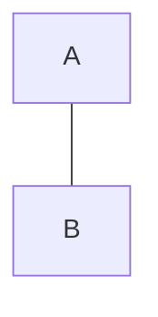

<script>
import mermaid from 'mermaid';
import { onMount } from 'svelte';
import { marked } from 'marked';


// import MarkdownIt from 'markdown-it'
// import { fromHighlighter } from 'markdown-it-shikiji/core'
// import { getHighlighterCore } from 'shikiji/core'
// import getWasm from 'shikiji/wasm'


import { Content, Grid, Row, Column, Select, SelectItem, Slider, TextInput, Button, ProgressBar, InlineNotification } from "carbon-components-svelte";
 
onMount(() => {
  mermaid.initialize({ startOnLoad: false });
  document.querySelectorAll('pre code.language-mermaid').forEach((el) => {
    const chart = el.textContent;
    el.parentNode.outerHTML = `<div class="mermaid">${chart}</div>`;
  });
  mermaid.init();
});

marked.setOptions({
  highlight: function(code, lang) {
    const language = hljs.getLanguage(lang) ? lang : 'plaintext';
    return hljs.highlight(code, { language }).value;
  }
});

function renderMarkdown(content) {
  return marked(content);
}

</script>

<Content><Grid><Row><Column>

## These are Markdown Posts

**Here's some stuff I use**

- SvelteKit
- VS Code
- Emojis 😎
   
     
## mermaid



### @TODO: Syntax Higlighting

## Markdown

Hey friends! 👋

```js
function greet(name: string) {
	console.log(`Hey ${name}! 👋`)
}
```


## JS
```js
// javascript ....
let dd = 5;
alert("Hello World!")
```


</Column></Row></Grid></Content>

